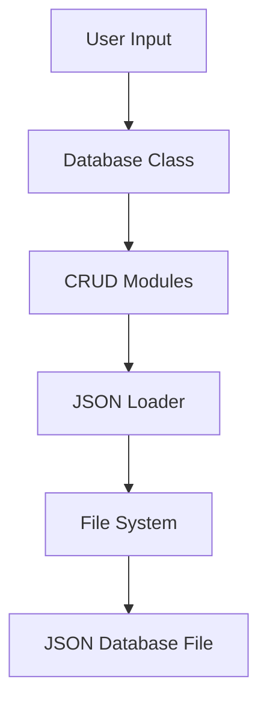

# JSON DB Engine

<div align="center">


<h1>JSON DB Engine</h1>

A lightweight JSON-based database engine built with Node.js and modern JavaScript.

Simple. Fast. Modular.

</div>

---

<div align="center">

## Tags

`nodejs` `javascript` `database` `json-database` `crud` `file-system`
`backend` `esmodules` `json-storage` `lightweight-database`
`database-engine` `opensource` `filesystem-database`

</div>

---

# Overview

JSON DB Engine is a lightweight file-based database management system designed for simplicity, modularity, and flexibility. The project provides a clean implementation of CRUD operations using JSON files as the primary data storage.

This project demonstrates how database concepts can be implemented without relying on external database services while maintaining a scalable and maintainable architecture.

---

# Features

* Lightweight and dependency-free
* JSON-based storage system
* Modular architecture
* CRUD operations support
* ES Modules support
* Easy integration into Node.js projects
* Simple and extendable codebase
* Beginner-friendly architecture
* Fast local JSON processing

---

# Project Structure

```bash
json-db-engine/
├── module.js        # File system module wrapper
├── load.js          # Load and parse JSON data
├── read.js          # Read database records
├── add.js           # Insert new records
├── find.js          # Search records by key/value
├── delete.js        # Delete records from database
├── main.js          # Core database class
├── example.js       # Example implementation
├── example.json     # JSON database file
├── package.json     # Project configuration
└── README.md        # Documentation
```

---

# Installation

## Requirements

* Node.js v12 or higher
* Git
* Code editor such as VS Code

## Clone Repository

```bash
git clone https://github.com/nasyuwaikrima/json-db-engine.git
```

## Navigate to Project Directory

```bash
cd json-db-engine
```

## Install Dependencies

```bash
npm install
```

---

# Quick Start

Run the example file:

```bash
node example.js
```

---

# Usage

## Initialize Database

```js
import Database from './main.js'

const db = new Database('./example.json')
```

---

## Read Data

```js
const data = db.read()

console.log(data)
```

### Example Output

```js
[
  {
    name: 'Nasyuwa',
    age: 17
  }
]
```

---

## Add Data

```js
db.add({
  name: 'Nasyuwa',
  age: 17
})
```

---

## Find Data

```js
const user = db.find('name', 'Nasyuwa')

console.log(user)
```

### Example Output

```js
{
  name: 'Nasyuwa',
  age: 17
}
```

---

## Delete Data

```js
db.delete('name', 'Nasyuwa')
```

---

# Database Format

All records are stored inside a JSON array.

```json
[
  {
    "name": "Nasyuwa",
    "age": 17
  }
]
```

---

# Technologies

| Technology      | Description               |
| --------------- | ------------------------- |
| JavaScript ES6+ | Main programming language |
| Node.js         | Runtime environment       |
| JSON            | File-based storage        |
| ES Modules      | Module system             |

---

# Architecture Flow



---

# Concepts Implemented

## JavaScript

* Object-Oriented Programming
* ES Modules
* Arrow Functions
* JSON Parsing and Stringifying
* Array Methods

## Node.js

* File System API
* Modular Architecture
* Synchronous File Operations

## Database Concepts

* CRUD Operations
* Data Persistence
* File-Based Storage

---

# Example Workflow

The example implementation demonstrates:

* Database initialization
* Reading stored data
* Adding new records
* Finding records
* Deleting records

---

# Future Improvements

Planned features for future releases:

* [ ] Async/Await file operations
* [ ] Advanced error handling
* [ ] Update/Edit functionality
* [ ] Data validation system
* [ ] Query filtering
* [ ] Schema validation
* [ ] Logging system
* [ ] CSV and XML support
* [ ] Performance optimization
* [ ] REST API integration
* [ ] Query caching

---

# Recommended README Enhancements

To make the repository more professional and visually appealing, consider using the following tools:

| Tool                    | Purpose                    |
| ----------------------- | -------------------------- |
| shields.io              | Repository badges          |
| readme-typing-svg       | Animated typing effect     |
| github-readme-stats     | GitHub statistics cards    |
| mermaid.js              | Flowcharts and diagrams    |
| carbon.now.sh           | Beautiful code screenshots |
| visitor-badge.glitch.me | Visitor counter            |

---

# Author

## Nasyuwa

* GitHub: [https://github.com/nasyuwaikrima](https://github.com/nasyuwaikrima)
* Email: [nasyuwa648@gmail.com](mailto:nasyuwa648@gmail.com)

---

# License

This project is licensed under the MIT License.

You are free to:

* Use commercially
* Modify the source code
* Distribute the project
* Use this project as a foundation for other systems

---

# Contributing

Contributions, issues, and feature requests are welcome.

Feel free to fork the repository and submit pull requests.

---

<div align="center">

### Built with Node.js and JavaScript

⭐ Star this repository if you found it useful.

</div>
